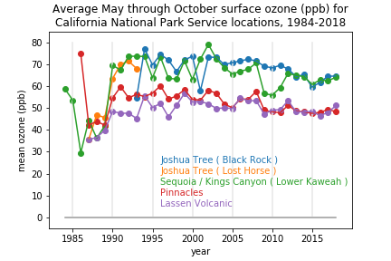

# National-Park-Service-Ozone
Ozone analyses derived from hourly California National Park Service observations

There are 4 National Park Service parks in California that take surface ozone observations: 
Mt. Lasssen Volcanic, Pinnacles (on the coast near Monterrey), Joshua Tree, and Sequoia / Kings Canyon. 
I would like to compare the long-term variability of mean May through October ozone for these stations
with the values from 98 stations of California Air Resources Board oservations that I have analyzed separately.

The first part of this analysis is to ingest the hourly ozone data, grouped by sets of years in csv-format files,
and create a dataframe with all of the hourly data for 1984-2018.  The next step is to calculate the maximum 8-hour
mean ozone for each day of the record for each station.  The maximum 8-hour mean (M8HM) is a standard metric for ozone air
quality calculations.  The third step is to calculate the mean M8HM ozone for May through October of each year.
These are the months of highest ozone in California.  Finally, a simple timeseries plot is constructed 

<!--  -->

Joshua Tree and Sequoia / Kings Canyon exhibit generally higher ozone amounts (~70 ppb) than do Pinnnacles and Lassen Volcanic (~50 ppb).  The low, ~40 ppb, ozone amounts for the series in 1986-1989 should be further investigated.
